# Тестовое задание Astral AI для аналитика по данным

Нам предоставлен датасет рентгенограмм органов грудной клетки, и набор разметок. В наборах представлена разметка врача-эксперта и трёх ML-алгоритмов.

Также врач-эксперт оценил корректность работы ML-алгоритмов по шкале от 1 до 5, где 5 – полностью согласен с разметкой интеллектуального алгоритма, 1 – полностью не согласен.

## Структура данных

**Dataset**

├── DX_TEST_RESULT_FULL.csv

├── Expert [100 entries exceeds filelimit, not opening dir]

├── OpenPart.csv

├── Origin [100 entries exceeds filelimit, not opening dir]

├── sample_1 [100 entries exceeds filelimit, not opening dir]

├── sample_2 [100 entries exceeds filelimit, not opening dir]

└── sample_3 [100 entries exceeds filelimit, not opening dir]

* **/Origin/** - Оригиналы рентгенограмм органов грудной клетки
* **/Expert/, /sample_1/, /sample_2/, /sample_3/** - директории с сегментационными картами
* **OpenPart.csv** - таблица оценок моделей экспертом по пятибалльной шкале
* **DX_TEST_RESULT_FULL.csv** - описание находок в виде прямоугольников и эллипсов

Ниже приведен пример таблицы описания находок моделью №2 для одной из картинок

|    |    file_name | user_name   |   xcenter |   ycenter |   rhorizontal |   rvertical | shape     |
|---:|-------------:|:------------|----------:|----------:|--------------:|------------:|:----------|
|  1 | 00000181_061 | sample_2    |   317.008 |   749.466 |       133.985 |    198.081  | rectangle |
|  2 | 00000181_061 | sample_2    |   731.318 |   926.697 |       152.133 |     69.5023 | rectangle |
|  3 | 00000181_061 | sample_2    |   714.715 |   628.609 |       129.351 |    216.229  | rectangle |

А это таблица с оценками моделей от эксперта

|    | Case             |   Sample 1 |   Sample 2 |   Sample 3 |
|---:|:-----------------|-----------:|-----------:|-----------:|
|  0 | 00000072_000.png |          1 |          5 |          1 |
|  1 | 00000150_002.png |          5 |          5 |          3 |
|  2 | 00000181_061.png |          4 |          4 |          3 |
|  3 | 00000211_019.png |          4 |          4 |          2 |
|  4 | 00000211_041.png |          3 |          5 |          2 |

*'sample_1', 'sample_2', 'sample_2' - идентификаторы ml алгоритмов*

### Примеры рентгенограмм

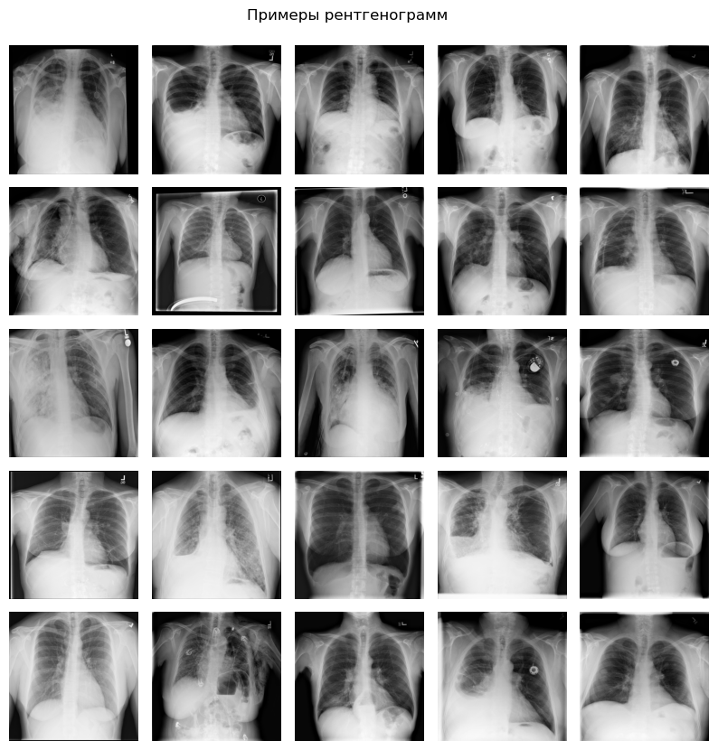

### Пример разметки

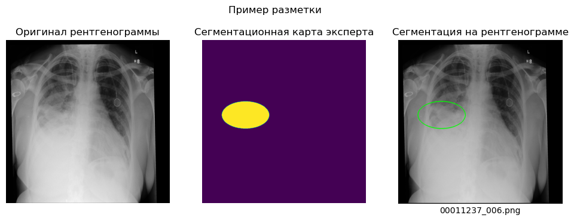

### Качество данных

Проведем анализ качества данных. Мы имеем в общем случае 100 рентгенограмм. Но в них могут быть дубликаты. Проверим их наличие с помощью перцептивного хеша горизонтальных градиентов интенсивности.

Возьмем порог схожести равный **7** и увидим, что есть две похожие картинки:

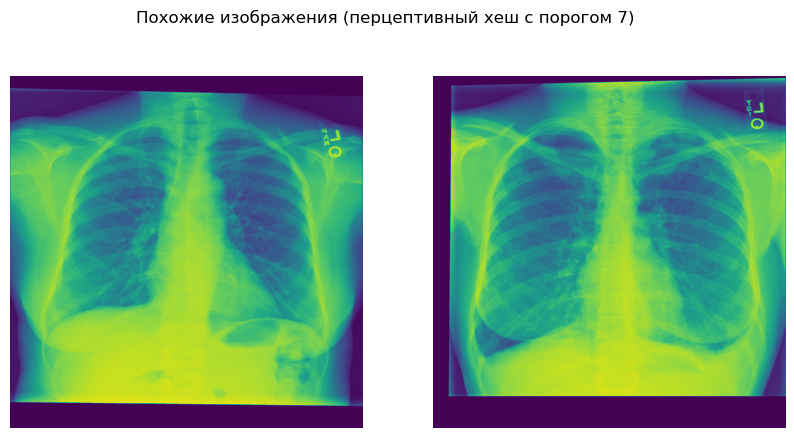

Картинки похожи, но явно различны. Делаем вывод, что дубликатов в датасете нет. Такой высокий порог обуславливается тем, что картинки с легкими все, в принципе, очень похожи.

### Пропуски разметки

Все картинки были размечены экспертом и моделями. При проведении проверки на полноту разметок пропусков не обнаруживаем:

### Баланс классов

В датасете присутствуют изображения, на которых эксперт не выделил патологий. Их немного, но об этом стоит знать.

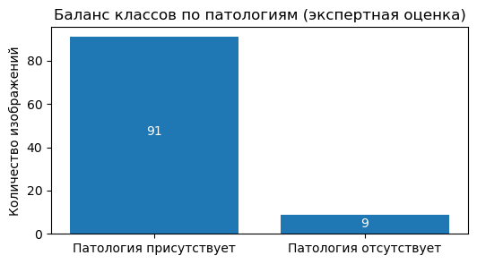

### Скрытые данные

Как уже было сказано ранее, работа моделей оценивалась экспертом. 

В данном датасете часть оценок скрыта, а именно оценки для 40 изображений из 100

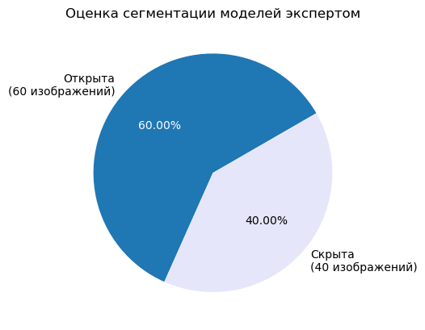

## Наблюдения

### Ошибка CSV файла находок

При чтении датасета находок возникали ошибки, связанные с разным форматом строк csv файла. Всего было выявлено 3 формата строк:

1. Разделитель: ',', на конце строки: ','
1. Разделитель: ', ', на конце строки: ','
1. Разделитель: ', ', на конце строки: ', '

Так как каждая строка отвечает за обнаружение на какой-либо картинке, было обнаружено странное совпадение (а может быть и не странное, а повлеченное определенным порядком создания датасета):

Изображения, описанные строками второго типа, но не описанные строками первого типа в какой-либо из разметок имеют пропуски.

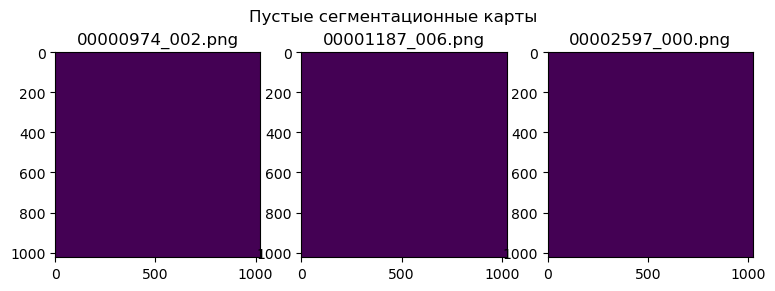

Как использовать данную информацию не представляю, но по крайней мере были выделены ошибки в csv файле, которые нужно учитывать при его открытии.

## Оценки

По предложенным сегментационным картам были посчитаны следующие попиксельные метрики:

**skeleton_dist**, (об этой метрике было сказано на треке "Ужасы медицинских данных" ([видео с привязкой ко времени](https://youtu.be/-1haCzvDKqg?list=LL&t=626))

Также, у нас есть оценка экспертом **expert_score**

### Корреляции оценок

Посмотрим на корреляции метрик сегментаций. Видно, что довольно неплохо с оценкой эксперта коррелирует **jaccard** и **skeleton distance**. Возможно, в рамках данной задачи эти метрики наиболее состоятельны.

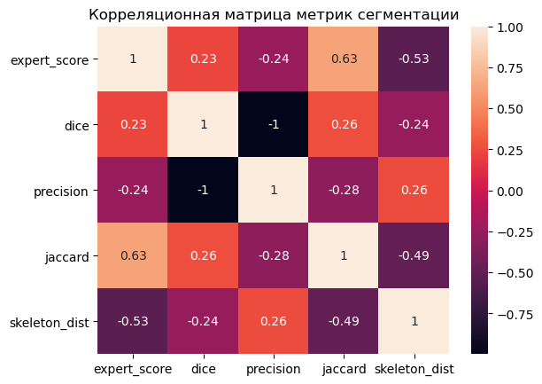

### Конфликт оценок

Можно заметить, что иногда метрика имеет довольно низкое значение, однако эксперт оценивает сегментацию модели на отлично. Например, на графике **expert_score/jaccard** видно точку, в которой *jaccard* < 1, а *expert_score* = 5.

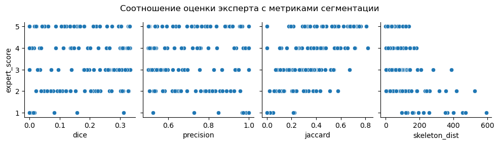

Посмотрим на эту картинку. Видно, что модель отметила участок с патологией. Не очень точно, но отметила!

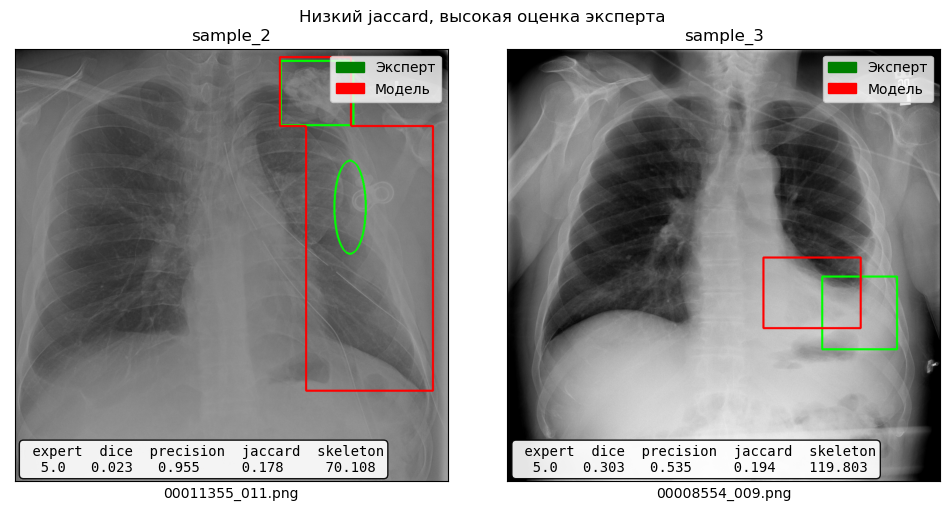

Возможно, эксперт высоко оценивал модели, локализующие все участки патологий, хоть и неточно. Посмотрим на другую ситуацию, когда оценка эксперта низкая, а jaccard высокий. 

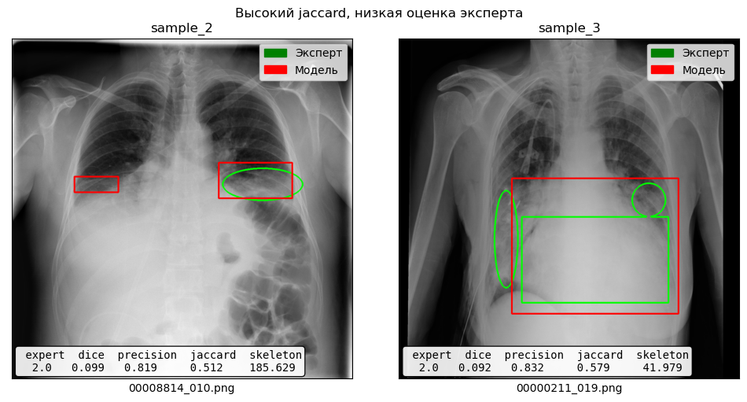

На картинке слева видно выделение лишней области, а справа три выделения ground truth модель поместила в одно.

### Бессилие моделей

Посмотрим на изображения, на которых сегментация патологий у моделей получилась хуже всего, по мнению эксперта

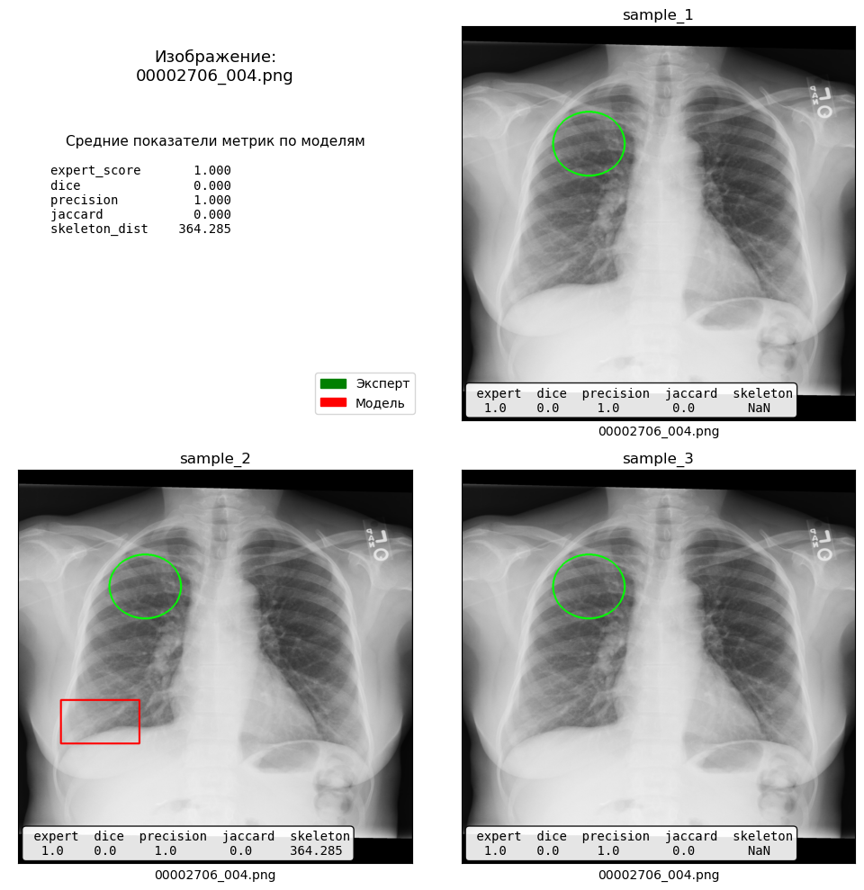

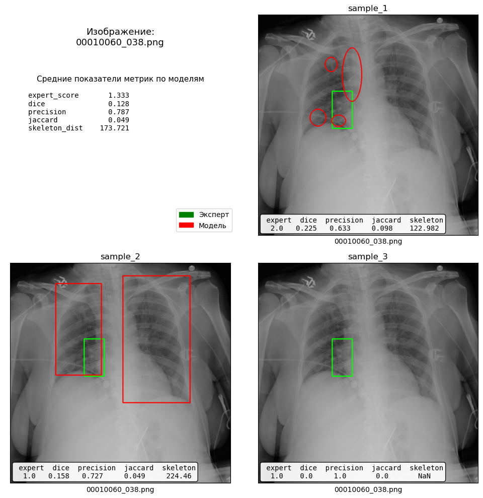

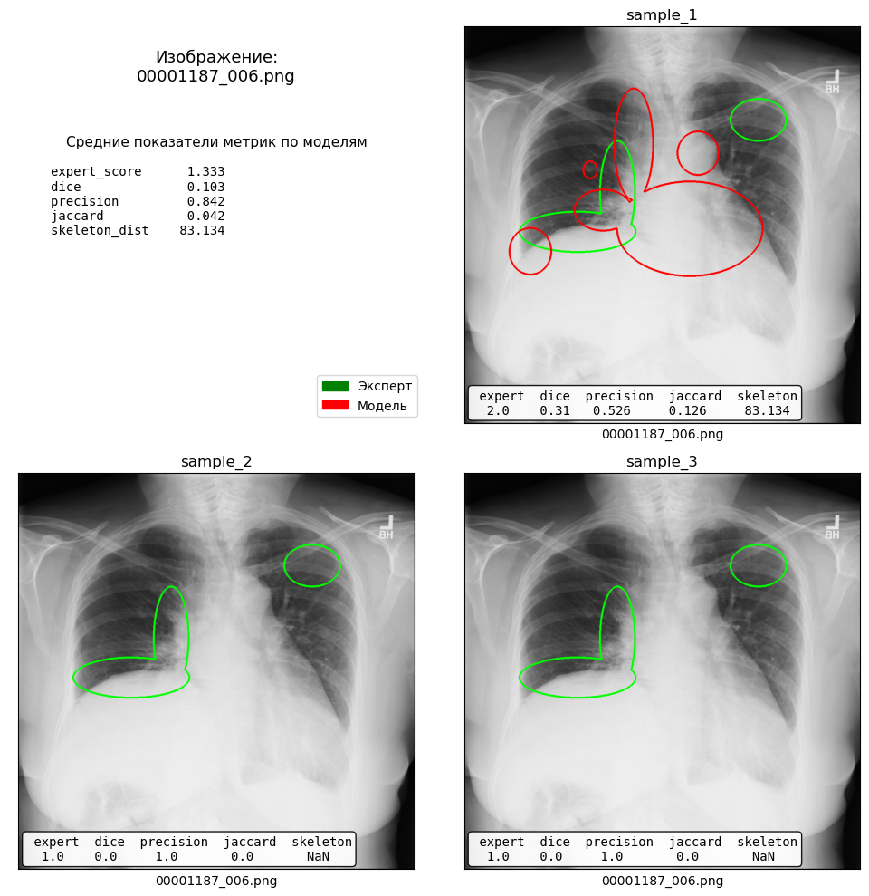

Здесь сложно делать выводы. Нужно объяснение человека, разбирающегося в данных патологиях.

### Предсказание оценки эксперта

Попробуем предсказать оценку эксперта по метрикам сегментации. Использовать будем линейную регрессию для интерпретируемости важности метрик (коэффициентов).

При кросс валидации получили среднюю абсолютную ошибку, равную 0.72, что не так уж и плохо. По моему мнению, такая ошибка вполне описывает человеческий фактор. Эксперт ведь тоже человек...

Посмотрим на коэффициенты при переменных и оценим важности метрик. Оказывается, в большей степени на оценку эксперта влияет dice.

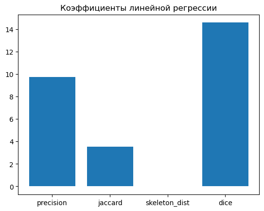

# Выводы

В ходе анализа данных мы изучили предоставленный датасет, сделали выводы о его качестве, выдвинули несколько гипотез, посмотрели на каких рентгенограммах модель ошибается больше всего.

**Резюме**

* В датасете присутствуют 100 изображений. 
* Для каждого изображения есть сегментационные карты, сделанные экспертом и тремя моделями. 
* Дубликатов не обнаружено. 
* Для 60 изображений есть экспертная оценка сегментаций моделей по пятибалльной шкале.
* В 9 рентгенограммах из 100, по мнению эксперта, отсутствует патология.
* Обнаружены ошибки создания CSV файла в таблице находок.
* Лучше всего с оценкой эксперта коррелируют метрики *jaccard* и *skeleton distance*
* Эксперт высоко оценивает модели, обнаружившие и локализовавшие патологию, даже если локализация неточная
* Эксперт низко оценивает модели, не обнаружившие или не локализовавшие патологию
* Оценку эксперта можно предсказать по метрикам сегментации, при этом средняя абсолютная ошибка предсказания: 0.72
